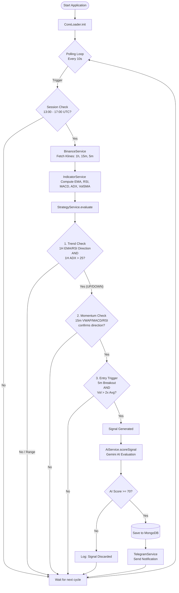

# Crypto Signal Generator - System Flow

This document details the operational flow of the trading bot.

## Key Components

1.  **CoreLoader**: The engine that runs the loop.
2.  **BinanceService**: Fetches raw market data (Oh, High, Low, Close, Volume).
3.  **IndicatorService**: Converts raw data into technical indicators.
4.  **StrategyService**: Applies the trading rules (Filters, Triggers).
5.  **AiService**: Validates the technical setup using LLM analysis.
6.  **TelegramService**: Delivers the final validated signal to the user.
